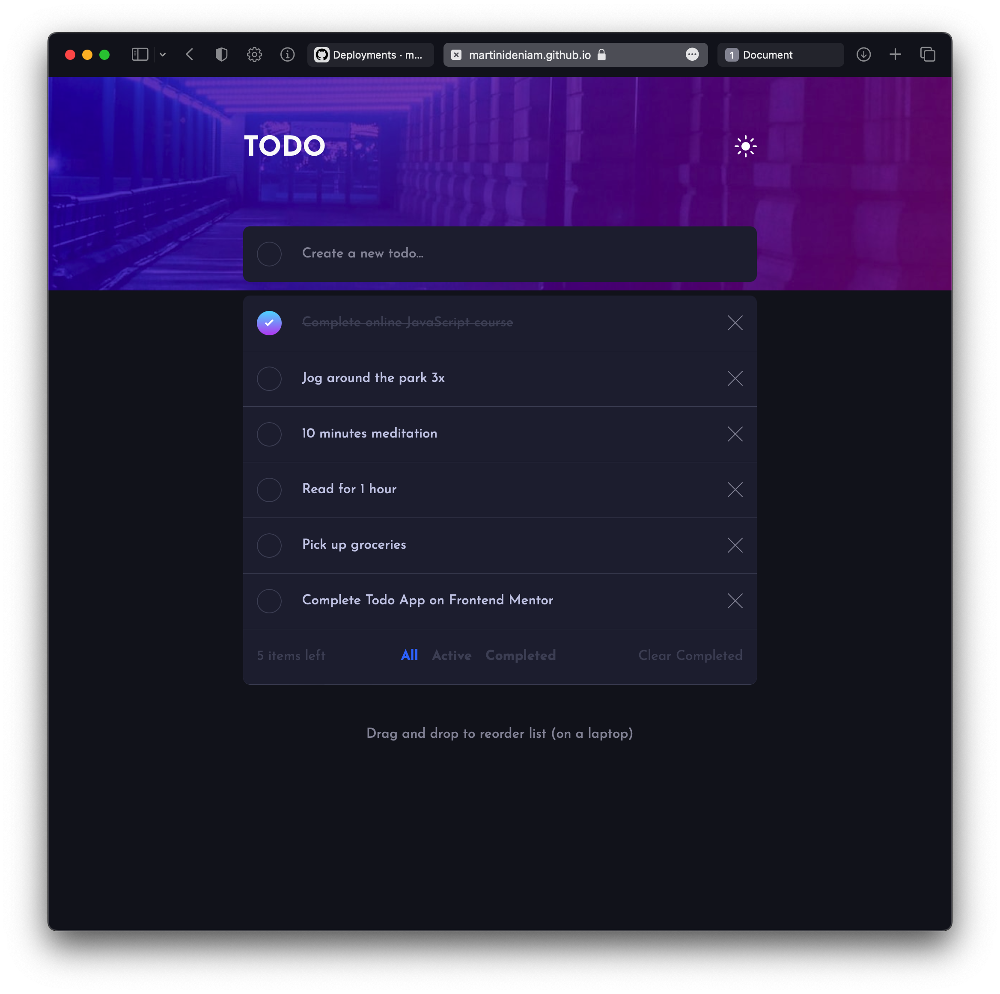
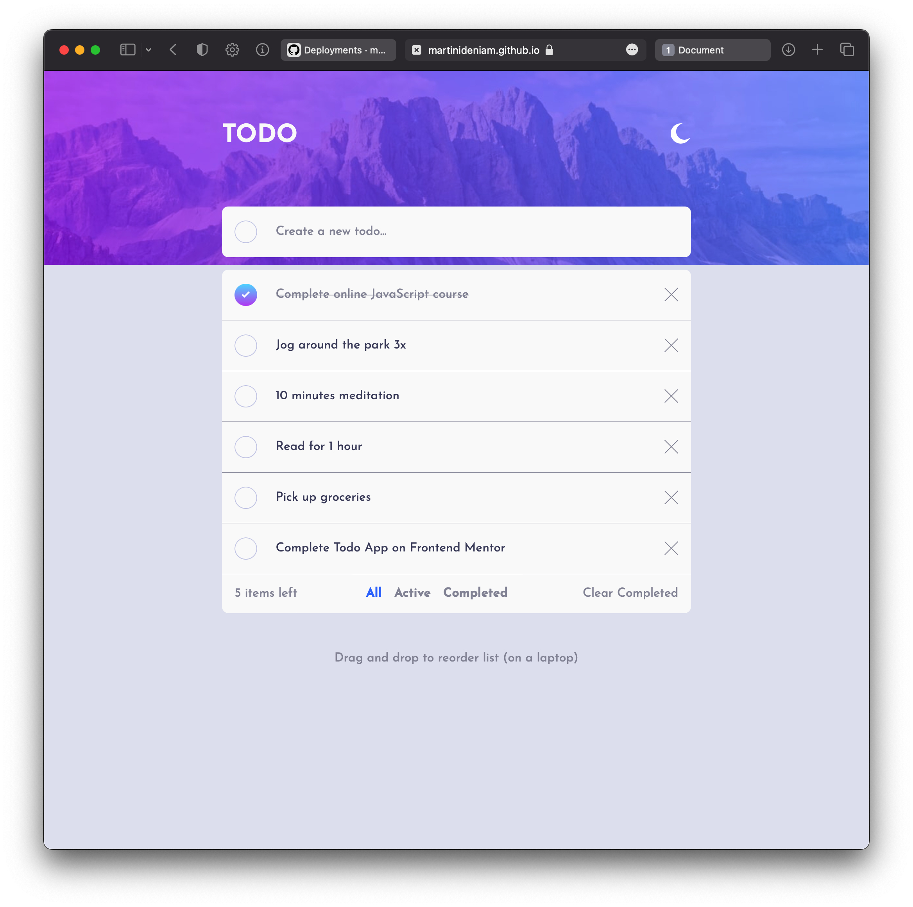

# Frontend Mentor - Todo app solution

This is a solution to the [Todo app challenge on Frontend Mentor](https://www.frontendmentor.io/challenges/todo-app-Su1_KokOW). Frontend Mentor challenges help you improve your coding skills by building realistic projects.

## Table of contents

- [Overview](#overview)
  - [The challenge](#the-challenge)
  - [Screenshot](#screenshot)
  - [Links](#links)
- [My process](#my-process)
  - [Built with](#built-with)
  - [What I learned](#what-i-learned)
- [Author](#author)

## Overview

### The challenge

Users should be able to:

- View the optimal layout for the app depending on their device's screen size
- See hover states for all interactive elements on the page
- Add new todos to the list
- Mark todos as complete
- Delete todos from the list
- Filter by all/active/complete todos
- Clear all completed todos
- Toggle light and dark mode
- Drag and drop to reorder items on the list

### Screenshot

### Links

- Solution URL: [my GITHUB](https://github.com/martinideniam/project-12-todo-app)
- Live Site URL: [my GITHUB page](https://martinideniam.github.io/project-12-todo-app/)

## My process

### Built with

- Semantic HTML5 markup
- CSS custom properties
- Flexbox
- CSS Grid
- Mobile-first workflow
- HTML Drag and Drop API
- SCSS / SASS

### What I learned

- I learned how to make drag and drop functionality
- I learned how to work with local storage / session storage
- I learned about touch events, however, couldn't make it work for this project

## Author

- Frontend Mentor - [@martinideniam](https://www.frontendmentor.io/profile/martinideniam)
- Twitter - [@vlad_webdev](https://twitter.com/vlad_webdev)
- Reddit - [@martin_eden_iam](https://www.reddit.com/user/martin__eden__iam)
